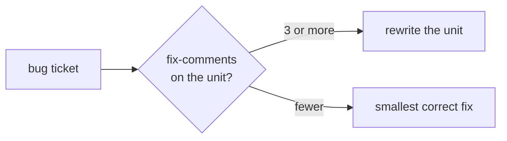

<p align="center">
  <picture>
    <source media="(prefers-color-scheme: dark)" srcset="assets/logo-dark.svg">
    
  </picture>
</p>

<h1 align="center">ken</h1>

<p align="center">
  <em>Try it, and if it doesn't work, throw it out and do it again.</em>
</p>

Ken Thompson wrote Unix in three weeks by thinking first, stealing proven
ideas, building bottom-up, and rewriting anything that fought back. **ken**
puts that discipline inside your AI agent.

Ken governs the method that produces code:

```
The loop, in order, on every task:
1. Think first        → build the mental model before touching the code
2. Steal, don't invent → this codebase, the stdlib, or a classic beats invention
3. Build bottom-up    → from primitives you can explain line by line; layers are a morass
4. Brute force        → the plain algorithm until measurement proves it wrong
5. Try it             → working code settles arguments prose can't
6. Throw it out       → a unit on its third patch gets rewritten, not patched a fourth
```

Plus the rules the loop rests on: features default to no, interfaces few and
small, no layer that only translates, a minimal trusted base (vouch for a
dependency before using it; never paste code you can't explain line by line),
know every line, debug the model not the symptom, no ceremony. Every rule
traces to Thompson's own words. [PROVENANCE.md](PROVENANCE.md) lists the sources.

## What ken measures

Ken makes method claims, so lines of code are not its benchmark. What it
measures instead: does the agent **rewrite** a thrice-patched unit instead of
adding patch four, **reuse** the project's helper instead of reinventing it,
fix the shared **root cause** instead of the named symptom, **vouch** for what
it depends on, and leave a **runnable check** behind. The behavior gates and
agentic quality tier in [benchmarks/](benchmarks/) measure those behaviors. A
maintenance-over-time benchmark scores what survives a sequence of tickets.

### The one rule with measured receipts



Same benchmark round, same bug ticket, same function carrying three dated
fix-comments — verbatim agent output from the kept workspaces
(run `20260826-203814`, haiku, 3 runs per arm):

**Without ken** — patch four, appended below the existing trail, in 3 of 3 runs:

```python
    # fix 2026-08-26 (#??): bare numbers are seconds (tracker exports)
    if num:
        total += float(num)
```

**With ken** — a rewrite, trail gone, in 3 of 3 runs:

```python
def parse_duration(s):
    """Parse '1h30m45s' into total seconds."""
    if s is None:
        return 0
    total = 0.0
    for match in re.finditer(r'([0-9.]+)([a-z])?', s.lower()):
        num = float(match.group(1))
        unit = match.group(2)
        if unit == 'h':
            total += num * 3600
        elif unit == 'm':
            total += num * 60
        else:
            total += num  # 's' or bare number: seconds
    return int(total)
```

Across that round ken rewrote 6 of 6 rot-seeded units; the no-skill arm
rewrote 0 of 6. Survival tied at 8/9. The same data also records what ken
does *not* fix: it guarded a ticket-named call site instead of the shared
helper in 3 of 3 runs — a documented limit, not a hidden one. Every round is
in [benchmarks/results/](benchmarks/results/).

## Install

Node.js must be on your PATH for the two lifecycle hooks. Skills work without
it, but activation stays quiet.

### Claude Code

```
/plugin marketplace add rajnandan1/ken
```

```
/plugin install ken@ken
```

From a local clone: `claude plugin marketplace add /path/to/ken` then
`claude plugin install ken@ken`.

### Other hosts

Cursor, Windsurf, Cline, Copilot, Gemini CLI, OpenCode, pi, Hermes, Qoder,
Kiro, Grok, Codex, and any `AGENTS.md`-reading agent: see
[docs/agent-portability.md](docs/agent-portability.md). MCP-only hosts:
[ken-mcp/](ken-mcp/).

## Levels

| Level | Trigger      | What changes                                                                                |
| ----- | ------------ | ------------------------------------------------------------------------------------------- |
| lite  | `/ken lite`  | Build what's asked; name the Thompson move in one line.                                     |
| full  | `/ken`       | The loop enforced. Brute force until measured. Rewrite over third patch. Default.           |
| ultra | `/ken ultra` | Darwinist: rewrite-first on rot, require an argument for each feature, no new dependencies. |

`/ken default <level>` persists across sessions (or `KEN_DEFAULT_MODE`, or
`~/.config/ken/config.json`). Off: say `stop ken`, or `/ken off`.

## Commands

`/ken` · `/ken-review` (method review: `rot:` `layer:` `unvouched:` `fancy:`
`ceremony:`) · `/ken-audit` (repo-wide) · `/ken-debt` (harvest `ken:`
brute-force ceilings) · `/ken-gain` (measured scoreboard) · `/ken-help`.

Deliberate brute-force ceilings are marked in code:

```js
// ken: linear scan; sort + bisect when n > 10k measured
```

## Safety limits

Brute force preserves correctness, input validation at trust boundaries, error
handling that prevents data loss, security, accessibility, and user
requirements. Ken traces a unit before rewriting it.

## Uninstall

Each host's own uninstall removes the plugin files; `node scripts/uninstall.js`
cleans up what those can't see (mode flag, config, statusline entry, while leaving
any other plugin's statusline segment intact).

## Provenance & credits

Rule-by-rule sourcing with ratings appears in [PROVENANCE.md](PROVENANCE.md),
including famous lines that researchers could not verify. The file marks those
lines as attributed.

Ken's plugin architecture and benchmark harness are derived from
[ponytail](https://github.com/DietrichGebert/ponytail) by Dietrich Gebert
(MIT; see [LICENSE](LICENSE)).

MIT © Raj Nandan Sharma
